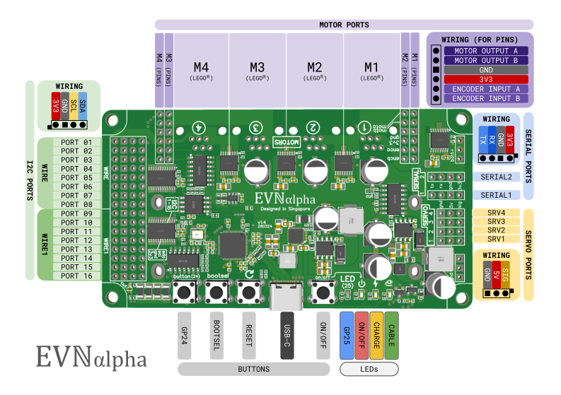
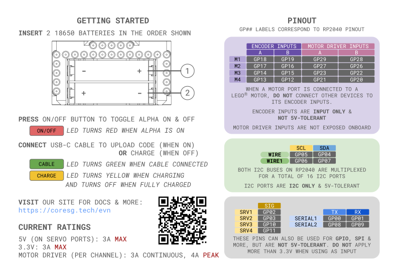

Hardware Overview
=================

Connections, Pinout & LED Status Guide
--------------------------------------
Front Side:

Back Side:

.. note::
    For pre-production versions of EVN (V1.3 and below), there are changes to the pin layout:

        * V1.3 & below
            * Servo ports have their layout flipped, such that the ground pin is closer to the edge of the board
            * Servo port numbers (1-4) are not printed on PCB, only the GPIO pins used

        * V1.2 & below 
            * Position of Servo and Serial Ports are swapped
            * Serial ports have their layout flipped, such that RX is closest to the edge of the board

Dimensions
----------

Hardware Details
----------------

I2C
"""
The I2C pins on the RP2040 are not directly exposed. Instead, to achieve a total of 16 individually addressable I2C ports, an 8-channel TCA9548A I2C Multiplexer (I2C address 0x70)
on both of the RP2040's I2C buses, and each channel is exposed as an I2C "port". Hence, the I2C ports are not GPIO-capable, but they are 5V-tolerant. The multiplexers can be controlled using I2C commands with ``Wire`` and ``Wire1``, or the interface provided by the ``EVNAlpha`` class.

Motor Drivers
"""""""""""""
EVN Alpha uses 8 of the RP2040's pins as motor driver inputs to control the 4 DRV8833 motor drivers onboard. These pins are not directly exposed, 
but the pin numbers are listed if you'd like to control the drivers directly.

But the motor driver outputs are directly exposed in 2 connector styles: 2.54mm headers and the NXT/EV3 motor port. As long as the total stall current does not exceed 3A, 
2 motors can be wired to the same motor port using both connectors.

Another 8 pins are used for the encoder inputs for each motor. Encoders cannot be wired in parallel, so do not use the encoder pins on both connectors at the same time. 
Since these pins pass their signals into a Schmitt-trigger inverter to clean up the signal, they are input-only pins. Setting the pins to output will not damage the board, but will not work as intended.

The encoder pins can also be used as Software Serial TX (input) pins, although this has not been tested.

GPIO
""""
The pins from the Serial and Servo ports can all be used as General Purpose Input/Output (GPIO) pins.

However, they are **not** 5V-tolerant, so they should not be connected to any devices which will apply more than 3.3V to the pin. This also applies when using the pins for SPI or Software Serial.

SPI
"""
The pins from the Serial and Servo ports can be repurposed for 2 hardware SPI connections.

====  ====  ====
Port  SPI0  SPI1
====  ====  ====
CS    GP01  GP09
SCK   GP02  GP10
SDI   GP00  GP08
SDO   GP03  GP11 
====  ====  ====

Software Serial
"""""""""""""""
The pins from the Servo Ports can be repurposed for 2 bi-directional or 4 uni-directional PIO-emulated Serial UART. It's not a hardware UART, 
but using PIO to emulate the ports means CPU overhead is minimized.

For information on programming these ports, look at this `page`_ on the Arduino-Pico docs.

.. _page: https://arduino-pico.readthedocs.io/en/latest/piouart.html

Battery Voltage Pins
""""""""""""""""""""
On each side of the serial and servo ports, there are 3 pins for unregulated battery voltage (6.3-8.4V) and ground respectively. Feel free to solder headers or wires to them and power more devices. Remember not to exceed the current rating of your batteries!

Charging Chip
"""""""""""""
For charging, we use TI's BQ25887 battery charge management IC, which charges the battery at 1.5A current.

This chip (I2C address 0x6B) is connected to I2C port 16, to provide battery voltage information.

If you need to remove this I2C connection, cut the 2 exposed traces left of the user button, labelled **cut**.

If you wish to enable charging while in on mode, cut the exposed trace right of the EVN logo, labelled **cut**.

    * Keep in mind that you will have to ensure your USB port can supply 5V 3A during upload, and motors may behave slightly differently when the batteries are charging.

Battery Voltage Cutoff
""""""""""""""""""""""

When the battery voltage dips below 6.2V, On Mode is disabled. Pressing the On/Off button will do nothing until the battery is charged above 6.3V.

Disassembly
"""""""""""

The PCB can be separated from the top and bottom shells by unscrewing the 4 M3 bolts at each corner with a 2.0mm hex screwdriver.